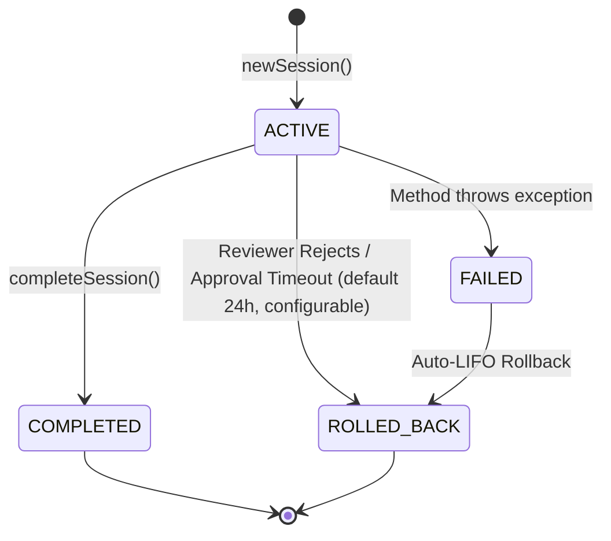

AgentRein provides zero-friction reliability for AI agents by acting as an invisible proxy and execution safety net. This page explains the key concepts and mechanisms that power AgentRein.

<Columns cols={3}>
  <Card title="Transparent Proxy" icon="shuffle">
    Intercepts SDK method calls at any depth while fully preserving original TypeScript types and Python client interfaces.
  </Card>

  <Card title="LIFO Rollback Engine" icon="rotate-left">
    Reverses multi-step production side-effects in strict Last-In-First-Out order when errors or rejections occur.
  </Card>

  <Card title="Human-in-the-Loop" icon="user-check">
    Pauses execution on high-risk actions to wait for human reviewer sign-off via dashboard or webhook.
  </Card>
</Columns>

---

## 1. The Transparent Recursive Proxy (`wrap()`)

At the core of AgentRein is the `wrap()` method. Instead of forcing developers to adopt custom client wrappers or new syntax, `wrap()` uses a JavaScript/Python proxy to intercept calls on existing SDK objects.

When you call `agentrein.wrap(client, session, { connector })`:

1. **Deep Nesting Support**: Intercepts method calls regardless of property depth (e.g., `octokit.rest.issues.create` or `stripe.subscriptions.cancel`).
2. **Operation Classification**: Automatically maps target method names (`create`, `update`, `delete`, `del`, `post`) into standardized backend operations (`CREATE`, `UPDATE`, `DELETE`).
3. **Payload & Response Capture**: Logs input arguments and execution responses to the backend action registry.
4. **Type Safety**: Preserves 100% of native TypeScript type signatures and IDE autocompletion.

<CodeGroup>
```typescript TypeScript
const agentStripe = agentrein.wrap(stripeClient, session, {
  connector: 'stripe',
});

// Calling wrapped methods executes normally while logging side-effects
const customer = await agentStripe.customers.create({
  email: 'user@example.com',
});
```

```python Python
agent_stripe = agentrein.wrap(stripe_client, session, connector="stripe")

# Calling wrapped methods executes normally while logging side-effects
customer = agent_stripe.customers.create(
    email="user@example.com",
)
```
</CodeGroup>

---

## 2. Session Lifecycle & State Machine

Every agent execution run is encapsulated within a **Session**. A Session groups related tool actions, tracks overall intent, and maintains execution state.



<Note>
  **Action vs. Session Status**: Individual actions carry an `ActionStatus` of `PENDING_APPROVAL` while waiting for human review, during which the parent Session remains `ACTIVE`. If an approval is rejected or times out, the Session transitions to `ROLLED_BACK` via LIFO compensation.
</Note>

### Session States

| State | Description |
| :--- | :--- |
| `ACTIVE` | Session is live and accepting action calls. |
| `COMPLETED` | Session finished cleanly after calling `completeSession(session)`. |
| `FAILED` | An action threw an exception or failed logging. |
| `ROLLED_BACK` | AgentRein successfully executed LIFO compensation for all logged actions. |

<CodeGroup>
```typescript TypeScript
// Start session
const session = await agentrein.newSession({
  agentId: 'billing-agent',
  intent: 'Process monthly invoice batch',
});

// Complete session on success
await agentrein.completeSession(session);

// Or trigger explicit manual rollback if needed
await agentrein.rollbackSession(session);
```

```python Python
# Start session
session = agentrein.new_session(
    agent_id="billing-agent",
    intent="Process monthly invoice batch",
)

# Complete session on success
agentrein.complete_session(session)

# Or trigger explicit manual rollback if needed
agentrein.rollback_session(session)
```
</CodeGroup>

---

## 3. Automatic LIFO Rollback Engine

When an agent executes multi-step workflows across external services, an unexpected failure midway can leave production systems in an inconsistent state.

AgentRein solves this by recording every state-modifying action in the backend **Rollback Registry**.

### How LIFO Rollback Works

1. **Side-Effect Tracking**: Each successful action captures inverse metadata (or an `undoConfig` strategy such as `http-delete` or connector-specific inverse calls).
2. **Reverse Execution Order**: If any step fails or an approval is rejected, AgentRein executes inverse compensation actions in strict **Last-In-First-Out (LIFO)** order (e.g., Step 3 $\rightarrow$ Step 2 $\rightarrow$ Step 1).
3. **Automatic Triggering**: Rollback triggers automatically when:
   - An unhandled exception occurs in wrapped SDK calls.
   - An approval request is explicitly rejected by a human reviewer.
   - A policy returns a `BLOCK` or expired approval decision.
   - You call `agentrein.rollbackSession(session)`.

<Note>
  Actions marked with an `undoConfig` type of `none` (such as immutable notifications) are logged for auditing but skipped during rollback execution.
</Note>

---

## 4. Human-in-the-Loop (HITL) & Approval Gates

For sensitive operations—such as canceling subscriptions, deleting databases, or deploying code—you can require explicit human approval before execution continues.

### SDK-Level Approval Gates

Pass `requiresApproval` (Python: `requires_approval`) with target method paths to `wrap()`:

<CodeGroup>
```typescript TypeScript
import { AgentRein, ApprovalRejectedError, ApprovalTimeoutError } from 'agentrein';

const agentStripe = agentrein.wrap(stripeClient, session, {
  connector: 'stripe',
  requiresApproval: ['subscriptions.cancel', 'customers.del'],
  pollIntervalMs: 2000, // Poll every 2 seconds
  timeoutMs: 300000,    // Wait up to 5 minutes
});

try {
  // Pauses execution and polls backend until approved/rejected
  await agentStripe.subscriptions.cancel({ id: 'sub_999' });
  console.log('Action approved and executed!');
} catch (err) {
  if (err instanceof ApprovalRejectedError) {
    console.error(`Approval rejected by reviewer: ${err.reason}`);
    // Session actions have already been automatically rolled back!
  } else if (err instanceof ApprovalTimeoutError) {
    console.error('Approval request timed out');
  }
}
```

```python Python
from agentrein import AgentRein, ApprovalRejectedError, ApprovalTimeoutError

agent_stripe = agentrein.wrap(
    stripe_client, session,
    connector="stripe",
    requires_approval=["subscriptions.cancel", "customers.delete"],
    poll_interval_ms=2000,
    timeout_ms=300000,
)

try:
    # Pauses execution and polls backend until approved/rejected
    agent_stripe.subscriptions.cancel(id="sub_999")
    print("Action approved and executed!")
except ApprovalRejectedError as err:
    print(f"Approval rejected by reviewer: {err.reason}")
    # Session actions have already been automatically rolled back!
except ApprovalTimeoutError as err:
    print("Approval request timed out")
```
</CodeGroup>

### Approval Execution Flow

<Steps>
  <Step title="Method Interception">
    `wrap()` checks if the target call path matches `requiresApproval`.
  </Step>
  <Step title="Pending Registration">
    SDK logs the action as `PENDING_APPROVAL` to the backend and generates an approval request.
  </Step>
  <Step title="Review Notification">
    The backend alerts human reviewers via Dashboard, Slack, or Webhook.
  </Step>
  <Step title="Client Polling">
    The SDK polls `GET /approvals/:id` at `pollIntervalMs` until resolved.
  </Step>
  <Step title="Outcome Execution">
    - **Approved**: Target method executes, action updates to `SUCCESS`.
    - **Rejected / Timed Out**: Throws `ApprovalRejectedError`/`ApprovalTimeoutError` and triggers automatic LIFO rollback.
  </Step>
</Steps>

---

## 5. Organization Policy Engine

Centralize governance rules across all agent teams using AgentRein's **Policy Engine**. Managed via the Dashboard REST API, policies enforce runtime behavior without requiring code changes to agents.

### Policy Rules & Pattern Matching

Policies target actions using `apiNamePattern` (e.g., `stripe.refunds.*`) and optional payload field conditions:

| Action Type | Behavior |
| :--- | :--- |
| `ALLOW` | Permits the action to run immediately. |
| `REQUIRE_APPROVAL` | Pauses action execution and requests reviewer sign-off. |
| `BLOCK` | Immediately rejects the action with a `403` error before execution. |

### Payload Conditions & Operators

Policies can evaluate specific payload fields using conditions (`eq`, `neq`, `gt`, `gte`, `lt`, `lte`, `contains`).

```json
{
  "apiNamePattern": "stripe.refunds.create",
  "condition": {
    "field": "amount",
    "operator": "gt",
    "value": 10000
  },
  "action": "REQUIRE_APPROVAL"
}
```

### Policy Conflict Resolution

When multiple enabled policies match an action, AgentRein evaluates them in order of strictness:
$$\text{BLOCK} > \text{REQUIRE\_APPROVAL} > \text{ALLOW}$$

---

## 6. Intent Verification & Drift Detection

AgentRein continuously evaluates whether agent actions align with their declared session goals.

### Outcome Statuses

When a session specifies an `intent`, AgentRein's LLM engine evaluates actual execution results against that intent:

- **`VERIFIED`**: The action outcome directly aligns with the stated intent.
- **`DRIFT_DETECTED`**: Outcome shows significant divergence from the intent (drift score $\ge 0.85$).
- **`UNVERIFIED`**: Verification system or infrastructure issue prevented evaluation (logged as a non-blocking warning).

### Drift Escalation

- **Standard Connectors**: Intent drift is logged in the audit trail and accessible via `GET /sessions/:id/intent`.
- **High-Risk Connectors & Policies**: Intent drift automatically creates a `PENDING_APPROVAL` request, pausing execution until a human reviewer inspects the drift.

---

## 7. Resilience, Retry & Sandbox Engine

### Failure Modes (`open` vs `closed`)

AgentRein allows you to configure client behavior if the AgentRein backend service becomes unreachable:

- `failureMode: 'open'` *(Default)*: Logs warning messages to standard output and permits tool execution to proceed without safety guarantees.
- `failureMode: 'closed'`: Strictly throws `AgentReinUnavailableError` and halts agent execution to prevent non-monitored actions.

### Automated Transient Retry

Specify transiently retryable method paths using the `retryable` parameter:

```typescript
const agentGithub = agentrein.wrap(octokit, session, {
  connector: 'github',
  retryable: ['issues.create', 'pulls.create'],
});
```

AgentRein automatically retries transient network errors using exponential backoff while embedding unique idempotency tokens into outgoing requests.